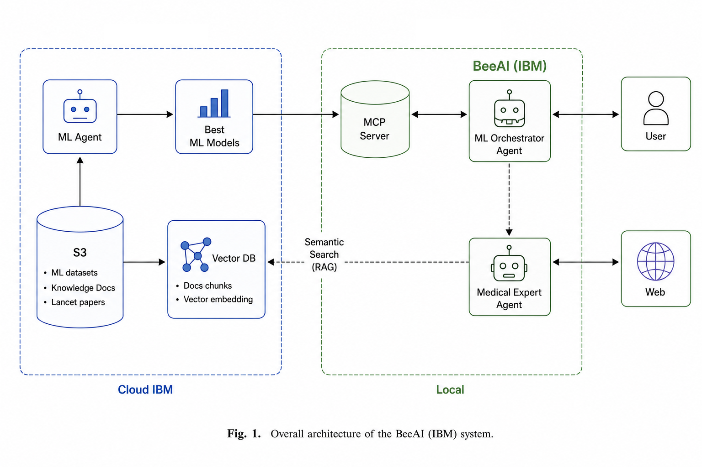

# MARGE — Multi-agent ML-Reasoning Guidance Engine

> **IBM × UNSA Hackathon 2025** — Clinical AI assistant that orchestrates niche tabular ML models and a medical expert sub-agent to produce sourced, evidence-grounded clinical guidance.



---

## What It Does

MARGE is a clinical decision-support system designed around a single hard constraint: **the orchestrator never produces medical claims from its own knowledge.**

A clinician or patient uploads clinical data and asks a question. MARGE:

1. **Consults a medical expert sub-agent** for clinical reasoning and differential diagnosis
2. **Selects and runs niche ML predictors** (diabetes risk, breast cancer malignancy) from its catalog — each returning a prediction, confidence, and SHAP-style feature importance scores
3. **Re-consults the expert** with ML results expressed as clinical values so the expert can interpret, confirm, or flag contradictions
4. **Produces a structured clinical report** only after both ML evidence and expert reasoning are present — enforced structurally by framework middleware, not by prompting

If the expert rules out every ML catalog condition, or if models conflict irresolvably, the orchestrator **abstains** and refers the user to a human specialist.

---

## IBM Stack

| Component | IBM Technology | Role |
|---|---|---|
| Agent orchestration | **BeeAI Framework** (IBM Research, open-source) | ReAct-style tool-use loop for the orchestrator and medical expert sub-agents; `RequirementAgent` middleware for protocol enforcement |
| LLM backbone | **IBM Granite 3.x via watsonx.ai** | Primary model for both orchestrator and expert; per-role routing with fallback support |
| Cloud storage | **IBM Cloud S3** | ML datasets, knowledge docs, and Lancet papers stored in object storage |
| Vectorized retrieval | **IBM Cloud** — Vector DB | Knowledge docs chunked, embedded, and indexed for semantic RAG search by the Medical Expert Agent |
| ML Agent & models | **IBM Cloud** | ML Agent and trained XGBoost ensemble models deployed on IBM Cloud; accessed by the local MCP server |

### Why BeeAI over LangGraph

BeeAI keeps control flow inside the LLM — the orchestrator decides at runtime which ML tool to call, iterates on results, and re-plans. A hardcoded graph would require enumerating every decision branch in advance, which breaks the "drop in a new model and the orchestrator just uses it" design goal.

The trade-off (losing graph-level flow guarantees) is offset by structural enforcement via BeeAI `RequirementAgent` middleware — the orchestrator literally cannot call `clinical_report` until both an ML tool result and an expert consultation result are present in the trajectory.

---

## Architecture

```
┌────────────────────────────────────────────────┐
│  Streamlit UI  (apps/streamlit_ui/)            │
│  • chat interface • CSV upload • session DB    │
└────────────────┬───────────────────────────────┘
                 │
   ┌─────────────▼─────────────┐
   │  Orchestrator Agent       │  BeeAI RequirementAgent
   │  (apps/orchestrator/)     │  "ML Head Researcher"
   │                           │  — never diagnoses directly
   └──┬──────┬─────────┬───────┘
      │      │         │
   MCP│   tool│      MCP│
      │      │         │
┌─────▼──┐ ┌─▼───────┐ ┌▼──────────────────┐
│ ML MCP │ │ Medical │ │ Patient Data MCP   │
│ Server │ │ Expert  │ │ Server             │
│        │ │ Agent   │ │                    │
│ XGBoost│ │BeeAI    │ │ SQLite seed DB     │
│ + SHAP │ │sub-agent│ │ + CSV upload       │
│ tools  │ │ (LLM)   │ │ tool               │
└────────┘ └─────────┘ └────────────────────┘
```

### Protocol Enforcement (Structural, Not Prompted)

Two `RequirementAgent` hooks enforce safety invariants:

- **`enforce_protocol`** (orchestrator-side) — `clinical_report` and `abstain` are hidden tools until the enforcer confirms that at least one ML tool result **and** one `consult_medical_expert` result are present in the current trajectory
- **`MARGEProtocolRequirement`** — BeeAI `Requirement` wired into the agent's planning loop; re-exposes gated tools only once conditions are met

This means the constraint is architectural — even if the system prompt were entirely removed, the agent physically cannot produce a final report without first running a predictor and consulting the expert.

---

## System Components

### Orchestrator (`apps/orchestrator/`)

BeeAI `RequirementAgent` assembly. Implements the "ML head researcher" persona:

- Holds the ML catalog and decides which predictors to call based on expert input
- Translates expert clinical language → ML tool arguments → clinical values back to expert
- Per-condition probe-back pattern: explicitly asks the expert whether each catalog condition is plausible, rather than trusting the expert to volunteer it unprompted
- Terminals: `clinical_report` · `request_more_info` · `abstain` · `consult_medical_expert`

### ML MCP Server (`services/ml_mcp_server/`)

FastMCP server exposing each ML model as a self-describing tool. The registry auto-discovers every non-`_` prefixed module in `models/` at startup — **adding a new clinical predictor requires one file, no other changes.**

**Registered models:**

| Tool name | Dataset | Task | Architecture |
|---|---|---|---|
| `predict_diabetes_risk` | Pima Indians Diabetes (OpenML, n=768) | Binary: diabetic risk vs low risk | XGBoost 5-fold ensemble + SHAP |
| `predict_breast_cancer_malignancy` | Wisconsin Diagnostic (UCI, n=569) | Binary: malignant vs benign | XGBoost 5-fold ensemble + SHAP |

Each prediction response includes per-feature SHAP importance scores so the orchestrator can quote "what drove this prediction" in the clinical report.

**`DynamicMLAgent` factory pattern** — new models configure themselves via `AgentConfig` (feature names, artifact path, target classes, training description). The factory builds the Pydantic input schema dynamically, runs K-Fold XGBoost ensemble training, sets up SHAP, and serializes to `.joblib`. Init-or-train lifecycle: if the artifact exists on disk, it loads directly.

### Medical Expert Sub-agent (`services/medical_expert_agent/`)

BeeAI `RequirementAgent` with a clinical-reasoning-only system prompt. The expert:

- Has no awareness of the orchestrator's ML catalog
- Reasons in pure clinical terms (differentials, thresholds, guidelines, referral recommendations)
- Attaches web search results as `Citation` objects via Tavily when `MARGE_ENABLE_WEB_RAG=true`
- Returns `MedicalExpertResponse(reasoning, citations)` — the orchestrator quotes expert reasoning directly into the final report

### Patient Data MCP Server (`services/patient_data_mcp_server/`)

FastMCP server exposing a single `get_patient_record` tool. Two source backends resolve to the same `PatientRecord` Pydantic schema:

- **SQLite seed DB** — curated sample patients for narrative-style demos
- **CSV upload adapter** — Streamlit file upload ingested in-memory per session

### LLM Provider Abstraction (`packages/llm_provider/`)

Thin wrapper over BeeAI's model adapter. Six providers supported, per-role routing, and optional `FallbackChatModel`:

| Provider | Default model | Free tier |
|---|---|---|
| **watsonx.ai** (IBM) | `ibm/granite-3-8b-instruct` | IBM hackathon credits |
| Anthropic | `claude-haiku-4-5-20251001` | — |
| Cerebras | `qwen-3-235b-a22b` | 30 RPM / 1M tokens/day |
| NVIDIA NIM | `qwen/qwen3-next-80b-a3b-instruct` | Free credits |
| Chutes | `moonshotai/Kimi-K2.5-TEE` | Free |
| Featherless | `moonshotai/Kimi-K2.5` | Free |

Per-provider rate-limit throttling is built in — free-tier providers with strict RPM limits (Cerebras 30 RPM, NVIDIA 40 RPM) get a shared async lock+sleep so back-to-back agent iterations stay under the quota.

---

## Layering Rules

```
apps/  →  services/  →  packages/
```

1. `apps/` depends on `services/` and `packages/`. Never the reverse.
2. `services/` depend only on `packages/`. Services are independent — `ml_mcp_server` cannot import from `medical_expert_agent`.
3. `packages/schemas/` is the only module imported everywhere.
4. The orchestrator accesses the medical expert **only** through the `consult_medical_expert` tool — never by direct import.
5. The medical expert never reads patient records — if context is needed, the orchestrator includes relevant fields in the consultation payload.

---

## Project Structure

```
marge/
├── apps/
│   ├── orchestrator/          # BeeAI RequirementAgent ("ML head researcher")
│   │   ├── agent.py           # agent assembly + async context manager
│   │   ├── system_prompt.md   # role, workflow, catalog-first probe rules
│   │   ├── tools/             # consult_expert, clinical_report, abstain, request_more_info
│   │   ├── middleware/        # enforce_protocol.py — gates clinical_report
│   │   └── requirements/      # marge_protocol.py — BeeAI Requirement wiring
│   └── streamlit_ui/          # chat UI, CSV upload, session management
│
├── services/
│   ├── ml_mcp_server/         # FastMCP: exposes ML models as tools
│   │   ├── models/            # one file per model (drop-in extension point)
│   │   │   ├── _base.py       # MLModel ABC
│   │   │   ├── _agent_factory.py  # DynamicMLAgent + AgentConfig factory
│   │   │   ├── diabetes_xgb.py
│   │   │   └── breast_cancer_xgb.py
│   │   ├── registry.py        # auto-discovers models/ at startup
│   │   └── artifacts/         # serialized .joblib files (gitignored)
│   ├── medical_expert_agent/  # BeeAI sub-agent: clinical-reasoning-only LLM
│   └── patient_data_mcp_server/  # FastMCP: patient records (SQLite + CSV)
│
├── packages/
│   ├── schemas/               # Pydantic v2 shared types
│   │   ├── prediction.py      # Prediction, XAIScore, ModelMetadata
│   │   ├── patient.py         # PatientRecord, ClinicalFeature
│   │   └── retrieval.py       # MedicalExpertResponse, Citation, RetrievedDocument
│   ├── llm_provider/          # provider abstraction, per-role routing, throttle
│   ├── ml_training/           # offline training scripts (diabetes, breast cancer)
│   └── medical_kb/            # local RAG corpus (Chroma + sentence-transformers)
│
└── tests/
    ├── unit/                  # per-module pytest
    ├── integration/           # MCP ↔ orchestrator wiring
    └── e2e/                   # Streamlit + full-stack flows
```

---

## Setup

Requires Python 3.11+ and [uv](https://docs.astral.sh/uv/).

```bash
# 1. Install core + orchestrator + UI dependencies
uv sync --extra orchestrator --extra ui

# 2. Train the ML artifacts (writes .joblib under services/ml_mcp_server/artifacts/)
uv run python -m packages.ml_training.train_breast_cancer
uv run python -m packages.ml_training.train_diabetes

# 3. Smoke test — verifies direct call == MCP call for every registered model
uv run python scripts/smoke_test.py

# 4. Unit + integration tests
uv run pytest tests/ -v

# 5. Configure credentials
cp .env.example .env
# Paste your provider keys (see .env.example for the full list)

# 6. Run the Streamlit UI
uv run streamlit run apps/streamlit_ui/app.py
```

Optional extras:

```bash
uv sync --extra medical-kb   # Tavily web RAG for expert citations (set TAVILY_API_KEY)
uv sync --extra dev          # ruff linter + pytest extras
```

### Provider Configuration (`.env`)

```ini
# Primary: IBM Granite via watsonx.ai
LLM_PROVIDER=watsonx
WATSONX_API_KEY=...
WATSONX_PROJECT_ID=...
WATSONX_URL=https://us-south.ml.cloud.ibm.com

# Per-role routing (override primary per agent)
ORCHESTRATOR_PRIMARY=watsonx
MEDICAL_EXPERT_PRIMARY=watsonx

# Optional fallback (e.g., Cerebras free tier)
ORCHESTRATOR_FALLBACK=cerebras
CEREBRAS_API_KEY=...

# Expert web RAG
TAVILY_API_KEY=...
```

---

## Adding a New ML Model

1. Create `services/ml_mcp_server/models/your_model.py`
2. Instantiate `AgentConfig` with feature names, artifact path, and dataset description
3. Subclass `DynamicMLAgent` and implement `__init__` (trigger training) + `sample_inputs()`
4. The registry auto-discovers it on next server start; the orchestrator gains the tool via MCP

No other files need to change. The orchestrator's system prompt lists available tools from its catalog at runtime.

---

## Runtime Data Flow

```
User query (+ optional CSV patient data)
   │
   ▼  Streamlit session
Orchestrator (BeeAI RequirementAgent, Granite / watsonx.ai)
   │
   ├─ get_patient_record()    ──MCP──▶  patient_data_mcp_server
   │
   ├─ consult_medical_expert()          medical_expert_agent (BeeAI sub-agent)
   │       └─ search_medical_web()  ──Tavily──▶  live medical sources
   │       └─ returns MedicalExpertResponse(reasoning, citations)
   │
   ├─ predict_diabetes_risk()  ──MCP──▶  ml_mcp_server  (XGBoost + SHAP)
   ├─ predict_breast_cancer()  ──MCP──▶  ml_mcp_server  (parallel)
   │
   ├─ consult_medical_expert()  (second pass — ML results → clinical interpretation)
   │
   └─ [RequirementAgent checks: ML ✓ + expert ✓]
      clinical_report()  ──▶  Streamlit renders prediction cards + SHAP + expert quote
```

If the expert rules out all catalog conditions after explicit per-condition probing, the orchestrator calls `abstain()` with a referral recommendation. `request_more_info()` is used mid-turn when required model inputs are missing.

---

## License

Apache 2.0
